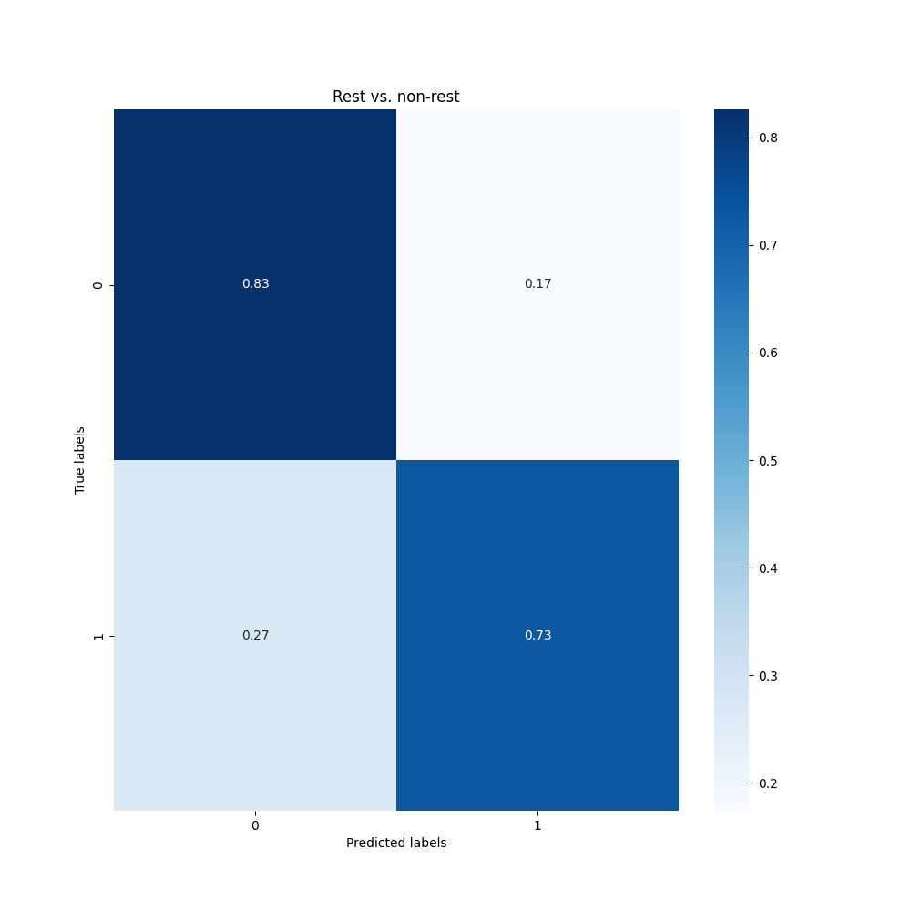
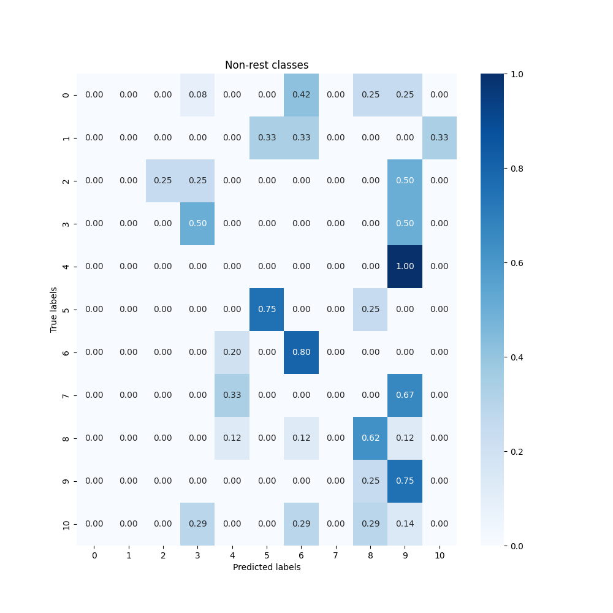
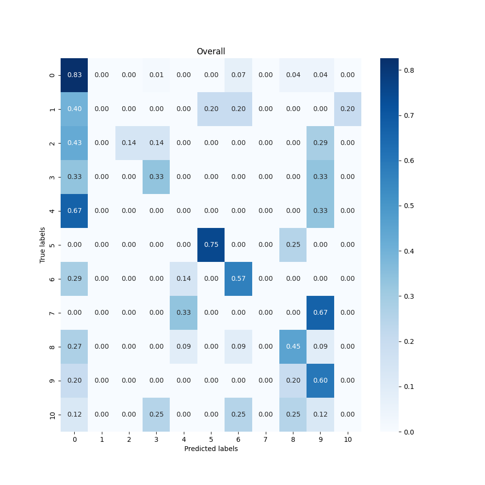
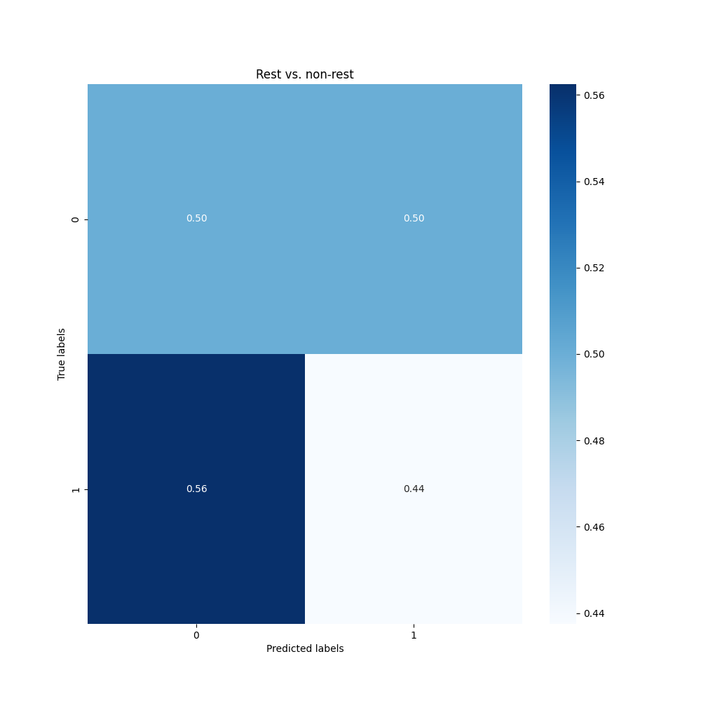
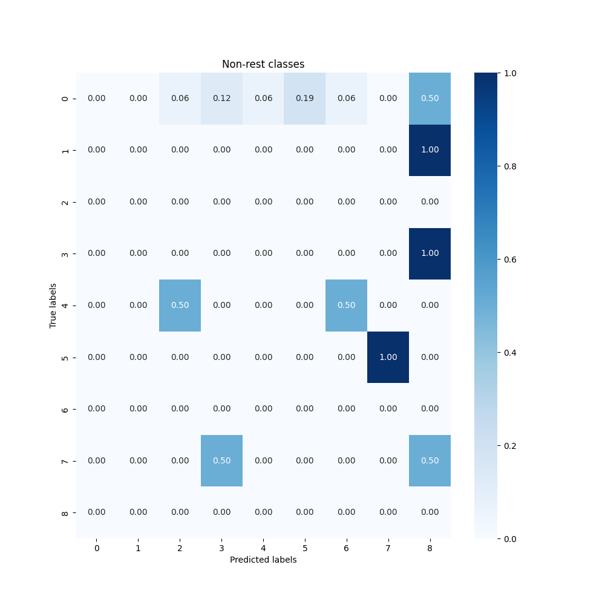
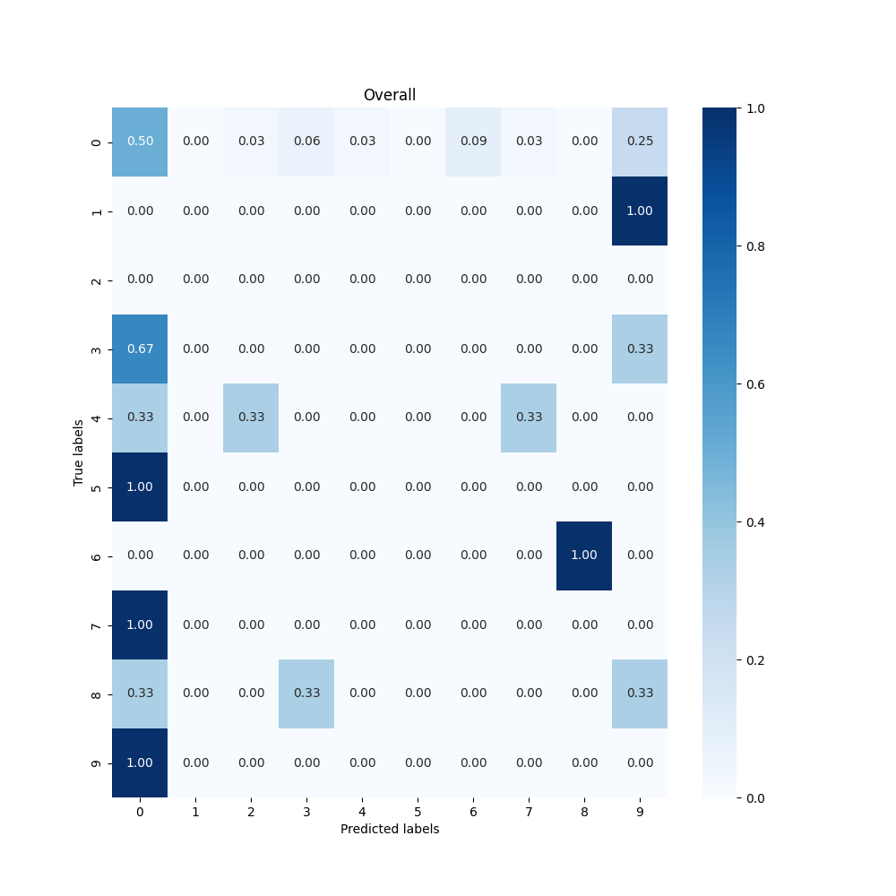

# fnirs-decoding

This was done for the [Telepathic Technologies](https://telepathic.tech/) [Final Codedown](https://finalcodedown.com/) challenge. The goal was to decode fNIRS signals into a rest state or one of 10 classes, each of which represent brain activity while viewing information related to one of 10 words in the NATO phonetic alphabet.

To this end, I developed two machine learning models, one to differentiate between rest and non-rest states (due to the heavy class imbalance, and because I believed it would be much easier to differentiate between rest and non-rest states than between the 10 classes), and another to differentiate between the 10 classes.

As background for this task, and during development, I took lots of notes! You can find my notes on [fNIRS](fNIRS.md) and [decoding language from fNIRS](Decoding%20language%20from%20fNIRS.md). I also have several initial experiments (not well organized or documented, unfortunately) in the [experiments_archive](experiments_archive) folder.

While these results aren't perfect or close to what I would like (especially for subject 2), I believe they are a good starting point for further work. With more time, I have several ideas for improving the models, including completely changing the architecture for subject 2, and using more techniques for data augmentation. I would also like to play around with different processing techniques to better capture the correct patterns. In addition, while I found that manual feature selection did not give me optimal results, I think that understanding the data better could lead to better feature selection and therefore a simpler model, such as random forests or SVMs.

## Model information

The [rest model](rest_classifier/cnn.py) is a CNN-based architecture from the paper [Rethinking Delayed Hemodynamic Responses for fNIRS Classification](https://ieeexplore.ieee.org/document/10311392). This uses domain knowledge about fNIRS signals to create a more specialized CNN architecture that includes convolutions separately both temporally and spatially.

The [non-rest model](non_rest_classifier/fnirsnet.py) is also a simple CNN of my own design.

Both models are trained with sliding windows to augment the limited training data. The training data for the non-rest model also includes some Gaussian noise added to the data to make the model more robust to noise and augment the training data further.

## Results 

### Subject 1

| Model | Accuracy |
| --- | --- |
| Rest | 0.7813 |
| Non-rest | 0.3273 |
| **Overall** | **0.5859** |

*[Rest model training](subject1_results/rest_model_training.png) | [Non-rest model training](subject1_results/non_rest_model_training.png)*

**Confusion matrices**

## Subject 2

| Model | Accuracy |
| --- | --- |
| Rest | 0.4792 |
| Non-rest | 0.0 |
| **Overall** | **0.3333** |

*[Rest model training](subject2_results/rest_model_training.png) | [Non-rest model training](subject2_results/non_rest_model_training.png)*

**Confusion matrices**

## Reproducing the results

You can reproduce the results by running `python evaluate.py` after installing the required packages (`pip install torch scikit-learn numpy matplotlib tqdm seaborn`). The package `mne` is only required to run the `convert_snirs_to_npy.py` script, which converts the raw `.snirs` files to unprocessed `.npy` files; however, this unprocessed data was never used in the final model, so you can skip this step.

The `evaluate.py` script will load the preprocessed data for the subject specified by [`SUBJECT_NAME`](/evaluate.py#L20) split it into train and test sets, train both models on the train set, and evaluate them individually and together on the test set. The overall accuracy results will be printed to the console, and more metrics are saved as .pngs (including loss plots and confusion matrices).
